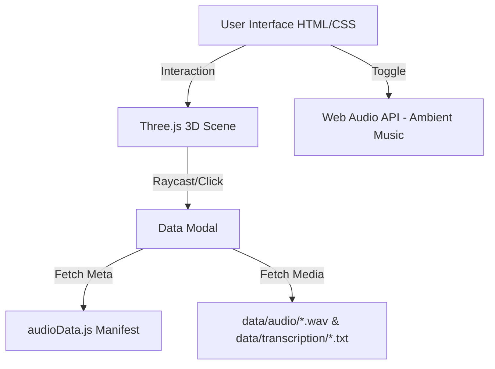

# NovaPath — ISS Satellite Tracker Project Report

## Project Summary
**What:** NovaPath is an interactive web application designed to track the International Space Station (ISS) and document radio signal captures from the CAMRAS ground station (Dwingeloo Radio Telescope, Netherlands). The project covers the tracking period from January 18th to February 12th, 2026.
**Outcome:** A fully functional, atmospheric 3D web experience that allows users to visualize the ISS's orbital data points, select specific capture dates, listen to the associated WebSDR radio recordings, and read their transcriptions.

## Problem Statement & Objectives
**Problem Statement:** To create an engaging, centralized platform for archiving and exploring amateur radio captures of the ISS, making technical telemetry and audio data accessible through a visually appealing interface.

**Objectives:**
- Develop a 3D visualization of the ISS and its orbital data points.
- Map and manage frequency/audio data to specific capture dates.
- Create an immersive user experience utilizing modern web design aesthetics and ambient audio.
- Ensure cross-page consistency and simple navigation.

## Architecture / Design

### Diagram (High-Level Flow)

### Components
1. **Frontend Core:** HTML5 and Vanilla CSS providing the layout, glassmorphism UI elements, responsive navbar, and background styling (starfield/nebula).
2. **3D Visualization Engine (`landing.js`):** Utilizes Three.js to render the central ISS sphere, orbital rings, and dynamic data nodes corresponding to recording dates. Implements raycasting for precise mouse hover and click detection.
3. **Data Layer (`audioData.js`):** Static JavaScript arrays acting as a manifest to connect recording dates to their corresponding audio files (`.wav`), transcription text files (`.txt`), and gallery images.
4. **Global Logic (`main.js`):** Handles site-wide functionalities, including mobile navbar toggling and an algorithmic procedural ambient space music generator using the Web Audio API.

## Environment & Setup
- **OS:** Windows
- **Languages:** HTML5, Vanilla CSS, JavaScript (ES6)
- **Libraries/Tools:** 
  - Three.js (v128 via CDN) for real-time 3D graphics in the browser.
  - Web Audio API (native browser API) for synthesizing ambient background audio.
  - Fonts: Google Fonts (Orbitron, Inter, Space Mono).
- **Directory Structure:**
  - `index.html`, `gallery.html`, `about.html`, `details.html`: Page templates.
  - `css/`: Modular stylesheets (`style.css`, `navbar.css`, `landing.css`, `gallery.css`).
  - `js/`: Application logic (`main.js`, `landing.js`, `audioData.js`, `gallery.js`).
  - `data/`: Media assets (`audio/`, `gallery/`, `transcription/`).

## Implementation / Work Done
- **3D Interactive Scene:** Implemented a central glowing ISS model with surrounding day nodes accurately mapped to the count of audio records. Added orbital rotation and gentle floating animations.
- **Raycasting UI Integration:** Engineered hover effects (node scaling, glowing) and click events on 3D objects to trigger 2D DOM modal popups seamlessly.
- **Dynamic Content Loading:** Developed a modal system that dynamically loads the correct `.wav` file into the HTML5 audio player and fetches the corresponding `.txt` transcription asynchronously based on the clicked 3D node.
- **Procedural Audio Generator:** Built a deep space drone synthesizer using multiple oscillators, LFOs, and biquad filters in `main.js` to create immersive background music without external audio files.
- **Data Structuring:** Organized historical tracking data (Jan 18 - Feb 12) into a cohesive JSON-like structure within `audioData.js`.

## Testing & Verification
- **Testing Approach:** Manual in-browser verification across modern web browsers.
- **Verification Evidence:**
  - *3D Interactivity:* Tested raycaster logic to ensure smooth intersection with moving 3D spherical nodes, confirming accurate index retrieval upon clicks.
  - *Media Loading:* Verified that clicking a node correctly populates the modal with the right date, frequency, audio file, and transcription text (handling both successful fetches and pending/missing transcriptions gracefully).
  - *Audio Generation:* Tested the Web Audio API synthesizer for cross-context start/stop functionality and appropriate volume leveling.
  - *Responsiveness:* Validated the CSS flexbox/grid layouts and mobile hamburger menu across different viewport sizes.

## Results & Observations
- The application successfully bridges complex 3D visualizations with straightforward content delivery (audio/text).
- Utilizing Vanilla JS and CSS kept the project lightweight while achieving a premium, modern aesthetic without the overhead of heavy frontend frameworks.
- The procedural ambient music significantly enhances the "space exploration" vibe of the site.
- The modular nature of `audioData.js` ensures that adding new ISS passes or satellite tracking data in the future requires zero changes to the core logic.
